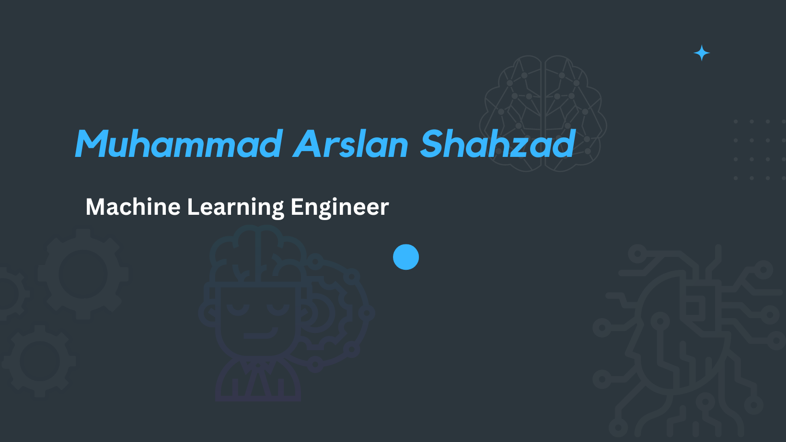

# Muhammad Arslan Shahzad

## "Empowering the world through machine learning"

I am a fresh ML engineer with expertise in deep learning, computer vision, and NLP. I have a passion for creating machine learning models that can solve real-world problems and improve people's lives.

## Skills

### Deep Learning

 

### Computer Vision

 

### NLP

 

### Python

  

### Deployment

 

### IDEs

 

### Cloud Technologies

  

## GitHub Analytics

## Contact

 ) 
